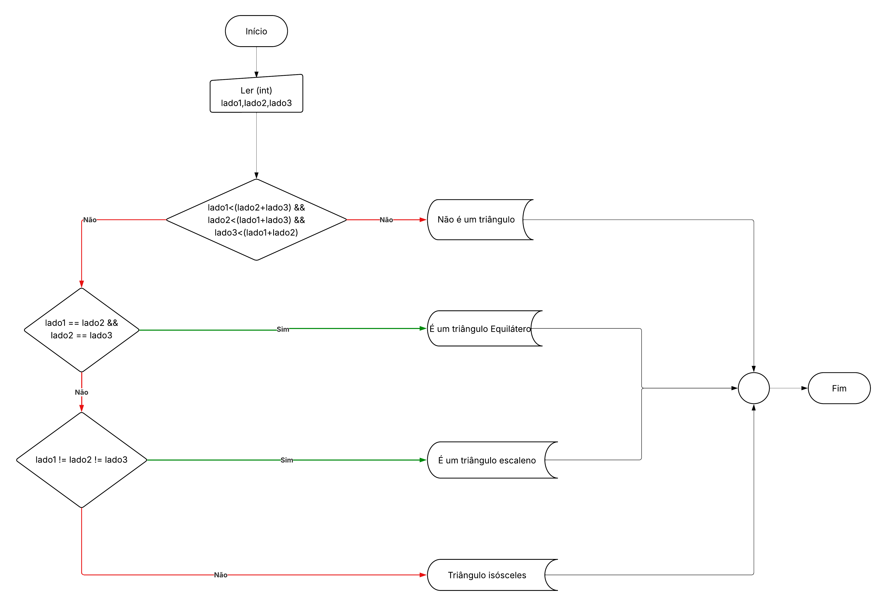

# UFC/ADS/Fundamentos da Programação

Esse repositório contém atividades relacionada à cadeira de "Fundamentos da programação" do CST Análise e Desenvolvimento de Sistemas da Universidade Federal do Ceará.

## Check Triangles

Esse projeto é fruto de um fluxograma que elaboramos na primeira aula de Fundamentos da Programação. O programa ele valida se a entrada do usuário corresponde à um triângulo e retorna a sua classificação quanto ao tamanho dos lados (Equilátero, Isósceles ou Escaleno).


Entradas possíveis:

```c
int lado1, lado2, lado3;

lado1 = 3;
lado2 = 4;
lado3 = 5;

---

lado1 = 2;
lado2 = 2;
lado3 = 2;

---

lado1 = 2;
lado2 = 2;
lado3 = 3;

---

lado1 = 4;
lado2 = 5;
lado3 = 10;

```

Saídas possíveis:

```bash

O tipo de triângulo é: 
Escaleno

---

O tipo de triângulo é: 
Equilátero

---

O tipo de triângulo é: 
Isósceles

---

Não é um triângulo

```
